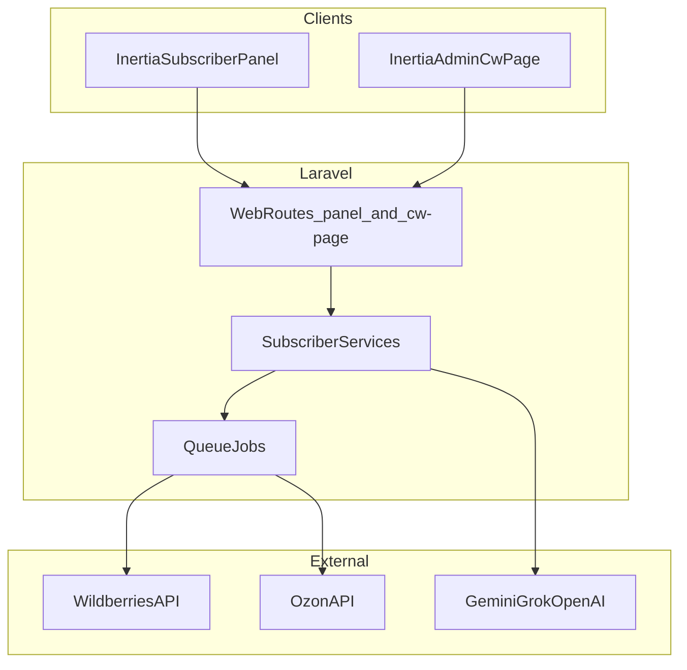

# Документация проекта subscribers_backend

Laravel-приложение для подписчиков маркетплейсов Wildberries и Ozon. Админка — Inertia + Vue 3 на `/cw-page/`; кабинет подписчика — Inertia + Vue 3 на `/panel/*`.

## Стек

| Слой | Технологии |
|------|------------|
| Backend | Laravel 13, MySQL, Composer |
| Admin frontend | Vue 3, Inertia.js, Tailwind, shadcn-vue, TanStack Table, Vite |
| Subscriber frontend | Vue 3, Inertia.js, Tailwind, shadcn-vue, Vite |
| Очереди | Laravel Queue (отдельные очереди на инструмент) |
| Баланс | `O21\LaravelWallet` |
| Права | Spatie Permission (`guard: web` для Inertia) |

## Архитектура



## Админка (`/cw-page/`)

Доступ по web-сессии (`auth`, `verified`):

| Роль / permission | Доступ |
|-------------------|--------|
| `super-admin` / `Супер-Админ` | Подписчики, планы, купоны, роли, сервисы, WB API stats |
| `blog.view` (+ create/update/delete) | Блог: посты, категории, теги |

Паттерн: `app/Http/Controllers/Web/Admin/*` → `app/Services/Admin/*` → `resources/js/Pages/Admin/*`.

Ключевые маршруты:

- `/cw-page/subscribers`, `/cw-page/plans`, `/cw-page/coupons` — управление подписчиками
- `/cw-page/services/feedbacks/*` — отзывы WB
- `/cw-page/services/repricer/*` — репрайсер
- `/cw-page/services/ai-cabinet/*` — ИИ-анализ кабинета
- `/cw-page/services/ai/*` — логи ИИ, архив расходов
- `/cw-page/wb/api-usage` — статистика WB API + drill-down по Seller ID

Legacy Vue SPA (`resources/js/views/dashboard/admin/`) удалён — админка полностью на Inertia.

## Кабинет подписчика (`/panel/`)

Доступ по web-сессии (`auth`, `verified`, `role:Подписчик`) + permission на конкретный инструмент.

Паттерн: `app/Http/Controllers/Web/Subscriber/*` → `app/Services/Subscriber/*` → `resources/js/Pages/Subscriber/*`.

JSON-эндпоинты для polling (генерации ИИ, статусы задач) отдают тот же контракт:

```json
{
  "success": true,
  "messages": ["..."],
  "data": {}
}
```

Ключевые маршруты: [`routes/subscriber.php`](../routes/subscriber.php), [`routes/subscriber-tools.php`](../routes/subscriber-tools.php).

## Инструменты

| Инструмент | Маркетплейс | Permission | Документация |
|------------|-------------|------------|--------------|
| AI Cabinet Analyzer | WB | `subscriber wb ai cabinet analyzer` | [wb-ai-cabinet-analyzer.md](wb-ai-cabinet-analyzer.md) |
| AI Marketplace | WB/Ozon | `subscriber ai` | [ai-marketplace.md](ai-marketplace.md) |
| Рентабельность | WB | `subscriber wb profitability` | [wb-profitability.md](wb-profitability.md) |
| Ценообразование V3 | WB | `subscriber wb price calculator` | [wb-price-calculation-v3.md](wb-price-calculation-v3.md) |
| Калькулятор акций | WB | `subscriber wb promo calculator` | [wb-promo-calculator.md](wb-promo-calculator.md) |
| Отзывы | WB | `subscriber wb feedbacks` | [wb-feedbacks.md](wb-feedbacks.md) |
| Отзывы | Ozon | `subscriber oz feedbacks` | [ozon-feedbacks.md](ozon-feedbacks.md) |
| Репрайсер | WB | `subscriber wb repricer` | [wb-repricer.md](wb-repricer.md) |
| Ценообразование | Ozon | `subscriber oz price calc` | [ozon-price-calculation.md](ozon-price-calculation.md) |
| Блог | — | `blog.view/create/update/delete` | [blog.md](blog.md) |

## Справочники

| Документ | Описание |
|----------|----------|
| [wb-ai-cabinet-analyzer-sales-funnel-fields.md](wb-ai-cabinet-analyzer-sales-funnel-fields.md) | Маппинг полей WB Sales Funnel |
| [ozon-price-calculation-frontend-columns.md](ozon-price-calculation-frontend-columns.md) | Колонки таблиц Ozon Price Calc для фронта |

## Платформенные модули (без отдельной документации)

- **Подписки и лимиты** — `SubscribersSubscriptions`, `limits_plan`, `limits_month`, `extra_limits_*` (JSON)
- **Платежи** — YooKassa (`/payments/yoo/*`)
- **Баланс** — пополнение/списание через wallet, лог `balance`
- **Админка подписчиков** — управление планами, купонами, ролями (Super-Admin)

## Ключевые файлы проекта

- Web-маршруты админки: [`routes/admin.php`](../routes/admin.php)
- Web-маршруты подписчика: [`routes/subscriber.php`](../routes/subscriber.php), [`routes/subscriber-tools.php`](../routes/subscriber-tools.php)
- Legacy API (auth, admin, webhooks): [`routes/api.php`](../routes/api.php)
- Permissions: [`database/seeders/Roles.php`](../database/seeders/Roles.php)
- Inertia-страницы админки: [`resources/js/Pages/Admin/`](../resources/js/Pages/Admin/)
- Навигация админки: [`resources/js/config/adminNav.js`](../resources/js/config/adminNav.js)