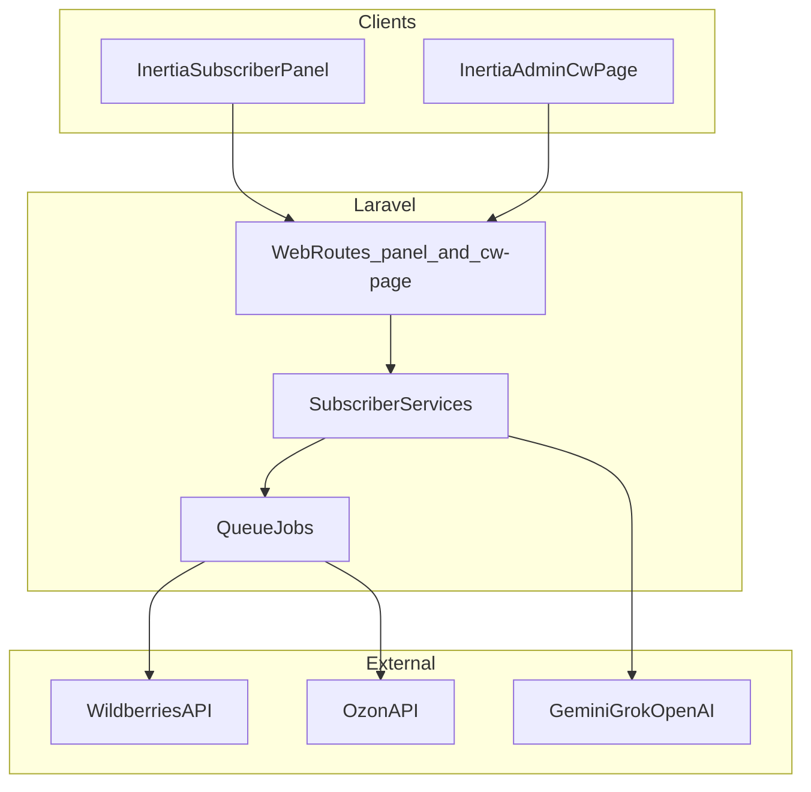

# Документация проекта subscribers_backend

Laravel-приложение для подписчиков маркетплейсов Wildberries и Ozon. Админка — Inertia + Vue 3 на `/cw-page/`; кабинет подписчика — Inertia + Vue 3 на `/panel/*`.

## Стек

| Слой | Технологии |
|------|------------|
| Backend | Laravel 13, MySQL, Composer |
| Admin frontend | Vue 3, Inertia.js, Tailwind, shadcn-vue, TanStack Table, Vite |
| Subscriber frontend | Vue 3, Inertia.js, Tailwind, shadcn-vue, Vite |
| Очереди | Laravel Queue (отдельные очереди на инструмент) |
| Баланс | `O21\LaravelWallet` |
| Права | Spatie Permission (`guard: web` для Inertia) |

## Архитектура


```mermaid
flowchart TB
    subgraph clients [Clients]
        InertiaSubscriber[InertiaSubscriberPanel]
        InertiaAdmin[InertiaAdminCwPage]
    end
    subgraph laravel [Laravel]
        WebRoutes[WebRoutes_panel_and_cw-page]
        Services[SubscriberServices]
        Jobs[QueueJobs]
    end
    subgraph external [External]
        WB[WildberriesAPI]
        Ozon[OzonAPI]
        AI[GeminiGrokOpenAI]
    end
    InertiaSubscriber --> WebRoutes
    InertiaAdmin --> WebRoutes
    WebRoutes --> Services
    Services --> Jobs
    Jobs --> WB
    Jobs --> Ozon
    Services --> AI
```

**Единый кабинет WB.** Для всех инструментов Wildberries используется одна сущность `wb_cabinets` (API-ключ + имя). Активный кабинет хранится в `users.selected_wb_cabinet_id` и выбирается в шапке панели. Tool-данные (`cabinet_id`) ссылаются на `wb_cabinets.id`. Подробно: [wb-cabinets.md](wb-cabinets.md).

Legacy API-роуты `/subscriber/*` для инструментов сняты (Phase 4): UI ходит только в Web/Inertia на `/panel/*`.

## Админка (`/cw-page/`)

Доступ по web-сессии (`auth`, `verified`):

| Роль / permission | Доступ |
|-------------------|--------|
| `super-admin` / `Супер-Админ` | Подписчики, планы, купоны, роли, сервисы, WB API stats |
| `blog.view` (+ create/update/delete) | Блог: посты, категории, теги |

Паттерн: `app/Http/Controllers/Web/Admin/*` → `app/Services/Admin/*` → `resources/js/Pages/Admin/*`.

Ключевые маршруты:

- `/cw-page/subscribers`, `/cw-page/plans`, `/cw-page/coupons` — управление подписчиками
- `/cw-page/services/feedbacks/*` — отзывы WB
- `/cw-page/services/repricer/*` — репрайсер
- `/cw-page/services/ai-cabinet/*` — ИИ-анализ кабинета
- `/cw-page/services/ai/*` — логи ИИ, архив расходов
- `/cw-page/wb/api-usage` — статистика WB API + drill-down по Seller ID

## Кабинет подписчика (`/panel/`)

Доступ по web-сессии:

```
auth + verified + panel.access + wb.cabinets.migrated
```

- `panel.access` — роль/доступ подписчика
- `wb.cabinets.migrated` — блокирует панель, пока не завершена миграция legacy WB-кабинетов (wizard `/panel/wb/cabinets/migration`)

Паттерн: `app/Http/Controllers/Web/Subscriber/*` → `app/Services/Subscriber/*` → `resources/js/Pages/Subscriber/*`.

JSON-эндпоинты для polling (генерации ИИ, статусы задач) отдают тот же контракт:

```json
{
  "success": true,
  "messages": ["..."],
  "data": {}
}
```

Ключевые маршруты: [`routes/subscriber.php`](../routes/subscriber.php), [`routes/subscriber-tools.php`](../routes/subscriber-tools.php).

### Shared props Inertia (панель)

| Prop | Описание |
|------|----------|
| `wb_cabinets` | Список общих кабинетов WB |
| `selected_wb_cabinet` | Активный кабинет WB |
| `wb_api_key_warning` | Текст о полном персональном ключе |
| `wb_migration_required` | Нужна миграция legacy-кабинетов |
| `oz_cabinets` | Список общих кабинетов Ozon |
| `selected_oz_cabinet` | Активный кабинет Ozon |

Переключатель кабинетов: `resources/js/components/subscriber/MarketplaceCabinetSwitcher.vue` (секции WB + Ozon).

## Инструменты

| Инструмент | Маркетплейс | Permission | Документация |
|------------|-------------|------------|--------------|
| **Единый кабинет WB** | WB | (панель) | [wb-cabinets.md](wb-cabinets.md) |
| **Единый кабинет Ozon** | Ozon | (панель) | [oz-cabinets.md](oz-cabinets.md) |
| AI Cabinet Analyzer | WB | `subscriber wb ai cabinet analyzer` | [wb-ai-cabinet-analyzer.md](wb-ai-cabinet-analyzer.md) |
| AI Cabinet Analyzer | Ozon | `subscriber oz ai cabinet analyzer` | [oz-ai-cabinet-analyzer.md](oz-ai-cabinet-analyzer.md) |
| AI Marketplace | WB/Ozon | `subscriber ai` | [ai-marketplace.md](ai-marketplace.md) |
| Рентабельность | WB | `subscriber wb profitability` | [wb-profitability.md](wb-profitability.md) |
| Ценообразование V3 | WB | `subscriber wb price calculator` | [wb-price-calculation-v3.md](wb-price-calculation-v3.md) |
| Калькулятор акций | WB | `subscriber wb promo calculator` | [wb-promo-calculator.md](wb-promo-calculator.md) |
| Отзывы | WB | `subscriber wb feedbacks` | [wb-feedbacks.md](wb-feedbacks.md) |
| Репрайсер | WB | `subscriber wb repricer` | [wb-repricer.md](wb-repricer.md) |
| A/B-тестирование | WB | `subscriber wb ab testing` | [wb-ab-testing.md](wb-ab-testing.md) |
| Ценообразование | Ozon | `subscriber oz price calc` | [ozon-price-calculation.md](ozon-price-calculation.md) |
| Блог | — | `blog.view/create/update/delete` | [blog.md](blog.md) |

### Маршруты WB (flat workspace)

После унификации кабинетов у WB-инструментов **нет** списка кабинетов на своей главной. Активный кабинет берётся из шапки:

| Инструмент | Workspace URL |
|------------|---------------|
| Отзывы | `/panel/wb/feedbacks` |
| Ценообразование | `/panel/wb/price-calc` |
| Репрайсер | `/panel/wb/repricer` (+ `/time`, `/stocks`) |
| Рентабельность | `/panel/wb/profitability` |
| ИИ-анализ | `/panel/wb/ai-cabinet-analyzer` |
| A/B-тестирование | `/panel/wb/ab-testing` |
| Калькулятор акций | `/panel/wb/promocalculator` |
| Кабинеты / миграция | `/panel/wb/cabinets/*` |

Старые URL вида `/panel/wb/{tool}/cabinets/{id}` редиректят на flat path.

Ozon использует **единый** кабинет (`oz_cabinets`) — см. [oz-cabinets.md](oz-cabinets.md).

## Справочники

| Документ | Описание |
|----------|----------|
| [queues.md](queues.md) | Все очереди и jobs проекта (обновлять при изменении/добавлении) |
| [wb-ai-cabinet-analyzer-sales-funnel-fields.md](wb-ai-cabinet-analyzer-sales-funnel-fields.md) | Маппинг полей WB Sales Funnel |
| [ozon-price-calculation-frontend-columns.md](ozon-price-calculation-frontend-columns.md) | Колонки таблиц Ozon Price Calc для фронта |
| [inertia-migration-matrix.md](inertia-migration-matrix.md) | Матрица миграции на Inertia |
| [inertia-migration-phase4-work.md](inertia-migration-phase4-work.md) | Phase 4: уход от Api\Subscriber |

## Платформенные модули (без отдельной документации)

- **Подписки и лимиты** — `SubscribersSubscriptions`, `limits_plan`, `limits_month`, `extra_limits_*` (JSON). Кабинеты: `wb_cabinets`, `oz_cabinets` (см. [wb-cabinets.md](wb-cabinets.md), [oz-cabinets.md](oz-cabinets.md))
- **Платежи** — YooKassa (`/payments/yoo/*`)
- **Баланс** — пополнение/списание через wallet, лог `balance`
- **Админка подписчиков** — управление планами, купонами, ролями (Super-Admin)

## Ключевые файлы проекта

- Web-маршруты админки: [`routes/admin.php`](../routes/admin.php)
- Web-маршруты подписчика: [`routes/subscriber.php`](../routes/subscriber.php), [`routes/subscriber-tools.php`](../routes/subscriber-tools.php)
- Legacy API (auth-adjacent, webhooks): [`routes/api.php`](../routes/api.php)
- Permissions: [`database/seeders/Roles.php`](../database/seeders/Roles.php)
- Inertia-страницы: [`resources/js/Pages/`](../resources/js/Pages/)
- Навигация подписчика: [`resources/js/config/subscriberNav.js`](../resources/js/config/subscriberNav.js)
- Навигация админки: [`resources/js/config/adminNav.js`](../resources/js/config/adminNav.js)
