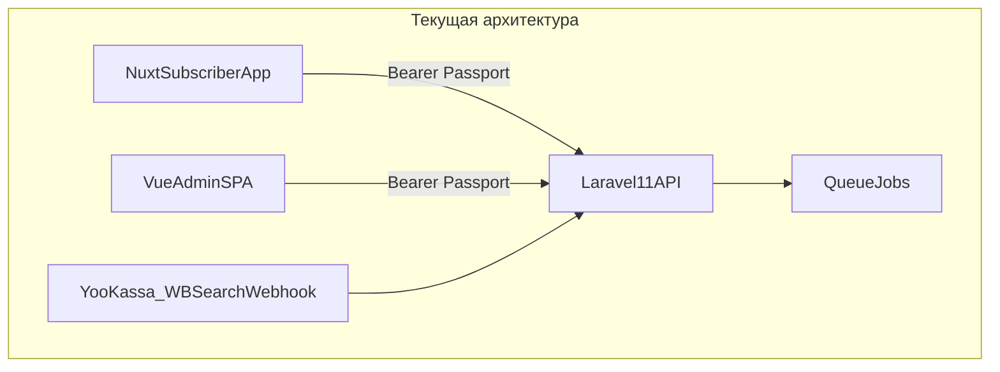
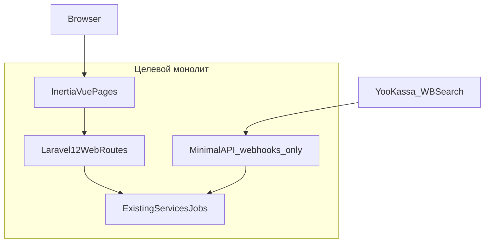
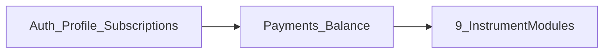
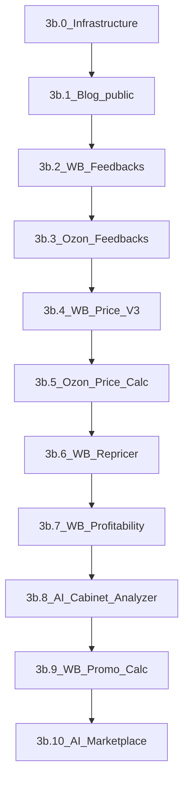

# Миграция в Laravel 13 + Inertia + Vue монолит

## Да, это реально — но это крупный проект

Текущий проект уже близок к целевому стеку: **Laravel 11**, **Vue 3**, **PrimeVue**, **Vite**, **Tailwind**. Основная работа — не «переписать backend», а **перенести два фронтенда** (встроенная админка + внешний Nuxt) на **Inertia** и **переключить auth с Passport Bearer на web-сессии**.

**Важное уточнение:** инструменты **WB Adverts**, **AutoSupply** и **WB Node** — **сняты с продукта**. Контроллеры подписчика уже удалены; в план добавлена **фаза зачистки** всего связанного кода до начала Inertia-миграции.

### Что есть сейчас



| Компонент                             | Масштаб                                                                  |
| ------------------------------------- | ------------------------------------------------------------------------ |
| API-маршруты                          | ~300 в `routes/api.php`, часть — мёртвые ссылки на удалённые контроллеры |
| Контроллеры                           | ~87 в `app/Http/Controllers/Api/`                                        |
| Модели / сервисы                      | ~60 моделей, 23 сервиса                                                  |
| Очереди / cron                        | 13 jobs, 20 console commands                                             |
| Админ-фронт (в репо)                  | ~60 `.vue` файлов, Vue Router + Vuex                                     |
| Фронт подписчика                      | **внешний Nuxt** (полный доступ есть)                                    |
| **Актуальные** инструменты подписчика | **9 модулей** (см. ниже)                                                 |

### Актуальный список инструментов (после зачистки)

| Инструмент          | Маркетплейс | Permission                          |
| ------------------- | ----------- | ----------------------------------- |
| AI Cabinet Analyzer | WB          | `subscriber wb ai cabinet analyzer` |
| AI Marketplace      | WB/Ozon     | `subscriber ai`                     |
| Рентабельность      | WB          | `subscriber wb profitability`       |
| Ценообразование V3  | WB          | `subscriber wb price calculator`    |
| Калькулятор акций   | WB          | `subscriber wb promo calculator`    |
| Отзывы              | WB          | `subscriber wb feedbacks`           |
| Отзывы              | Ozon        | `subscriber oz feedbacks`           |
| Репрайсер           | WB          | `subscriber wb repricer`            |
| Ценообразование     | Ozon        | `subscriber oz price calc`          |
| Блог                | —           | `blog.*`                            |
| Фулфилмент          | —           | `manager fullfilment`               |

**Удаляются:** WB Adverts, AutoSupply, WB Node (auth callbacks, autobook).

### Целевая архитектура



---

## Фаза 0a: Зачистка удалённых инструментов (2–3 дня)

**Цель:** убрать весь код Adverts / AutoSupply / WB Node, чтобы репозиторий был консистентен перед миграцией.

### Backend — удалить

| Категория                 | Файлы / зоны                                                                                                                                                                      |
| ------------------------- | --------------------------------------------------------------------------------------------------------------------------------------------------------------------------------- |
| **Маршруты**              | `routes/api.php`: блоки `subscriber wb advert`, `subscriber/wb` (accounts, real/cabinets, autosupply, auto-supplies), `admin/wb/adv/*`, middleware `wb.node` + autobook callbacks |
| **Контроллеры (остатки)** | `app/Http/Controllers/Api/Admin/wb/adv/AdvertsController.php`, `AdminAdvertsBotLogController.php`, `WbRealCabinetController.php`, `AuthController` (WB)                           |
| **Модели**                | `app/Models/Dashboard/WB/adv/*`, `app/Models/Subscribers/Wb/AutoSupply/*`, `WbRealCabinet.php`                                                                                    |
| **Jobs**                  | `WbLoginJob.php`, `WbOtpJob.php`                                                                                                                                                  |
| **Сервисы**               | `WbSuppliesService.php`, `WbAutomationService.php` — если не используются другими модулями                                                                                        |
| **Прочее**                | `WBadvTrait.php`, `AdvLog.php`, `WbRealCabinetPolicy.php`, middleware `wb.node` в `Kernel.php`, регистрация policy в `AuthServiceProvider.php`                                    |
| **Permissions**           | `subscriber wb advert`, `subscriber wb autosupply`, `admin wb adverts controll` из `database/seeders/Roles.php` и планов подписок                                                 |
| **Документация**          | `docs/wb-adverts.md`, `docs/wb-autosupply.md`, строки в `docs/README.md`                                                                                                          |

### Frontend — удалить

| Категория           | Файлы                                                         |
| ------------------- | ------------------------------------------------------------- |
| Admin WB Adverts UI | `resources/js/views/dashboard/admin/wb/adv/*`, `AdBotLog.vue` |
| Ссылки в UI         | упоминания `adverts_clients` в `PlansTariffLimitsBlock.vue`   |
| Vue-router          | маршруты admin/wb/adv (если есть в отдельном файле)           |

### База данных

- Таблицы `wb_autosupply_*`, `wb_real_cabinets`, advert-related tables — **не удалять миграции** (история), но можно добавить migration `drop_*` если таблицы больше не нужны в prod.
- Проверить `2026_05_06_120000_change_wb_apikey_columns_to_text.php` — убрать `wb_autosupply_cabinets` из списка, если таблица дропается.

### Nuxt-репозиторий

- Удалить/архивировать страницы Adverts, AutoSupply, WB auth flow.
- Убрать permissions из меню и роутов.

### Проверка после зачистки

- `php artisan route:list` — нет битых controller references
- `composer dump-autoload` — нет missing class
- `npm run build` — нет импортов удалённых Vue-страниц
- Прогон существующих тестов

---

## Фаза 0b: Подготовка и апгрейд Laravel (1–2 дня)

1. **Laravel 11 → 13.8** — `composer.json`: `laravel/framework ^13.8`, `phpunit ^12`, Carbon 3.
2. Зафиксировать `spatie/laravel-permission` явно в composer (используется, но не объявлен).
3. **Восстановить `vite.config.js`** — отсутствует в репо.
4. Smoke-тесты оставшихся API-модулей.

---

## Фаза 1: Inertia-инфраструктура + новая auth (3–5 дней)

### Backend

- `inertiajs/inertia-laravel` + `@inertiajs/vue3`
- `resources/views/app.blade.php`, HandleInertiaRequests (user, permissions, flash)
- **Web session auth** вместо Passport для UI
- VK / Yandex OAuth — адаптировать под Inertia redirect flow

### API slim-down

Оставить в `routes/api.php` **только**:

- `POST /payments/yoo/callback`
- `POST services/wb-search/webhook` (repricer competitors)
- публичный блог/sitemap (опционально для SEO)

**Убрать полностью:** wb.node, autobook, adverts, autosupply routes.

### Frontend foundation

- **Новый стек:** Vue 3 + Inertia + Tailwind + shadcn-vue + TanStack Table + Lucide + VueUse + ApexCharts
- **Не использовать:** PrimeVue, Vuetify, Material Design
- **Порядок:** Design system → shadcn components → Layout → Pages
- Vue Router / Vuex / PrimeVue `components/ui/` — удалены, не портировать
- Shared props + composables/Pinia для локального state

---

## Фаза 2: Миграция админки (2–3 недели)

Перенос существующего Vue SPA из `resources/js/views/dashboard/admin/`.

**Без WB Adverts** — этот блок удалён на фазе 0a.

| Модуль                          | Подход                             |
| ------------------------------- | ---------------------------------- |
| Dashboard / widgets             | Inertia page + partial reload      |
| Подписчики, планы, купоны       | Form Requests + Inertia forms      |
| Роли и permissions              | shared `permissions` prop          |
| Feedbacks / Repricer / AI admin | по одному модулю                   |
| Blog admin                      | composables → Inertia actions      |
| WB API Usage Stats              | сохранить (`WbApiRequestLogs.vue`) |

Паттерн: `Web/Admin/*Controller` → `Inertia::render()`, бизнес-логика в `app/Services/` без изменений.

---

## Фаза 3: Миграция Nuxt-фронта подписчика (5–8 недель)

Поэтапно, **9 инструментов** (+ платформа):



### Порядок модулей

1. Платформа: регистрация, профиль, планы, подписки, лимиты, YooKassa, купоны
2. Блог (пилот Inertia)
3. WB Feedbacks
4. Ozon Feedbacks
5. WB Price Calc V3
6. Ozon Price Calc
7. WB Repricer
8. WB Profitability
9. AI Cabinet Analyzer
10. WB Promo Calculator
11. AI Marketplace

### На каждый модуль

1. Инвентаризация Nuxt-страниц
2. `routes/web.php` + permission middleware
3. `Web/Subscriber/*Controller` с reuse Services
4. Vue → `resources/js/Pages/Subscriber/...`
5. Polling/long-tasks через Inertia `usePoll` / partial reload
6. Регрессия по `docs/*.md`

---

## Фаза 4: Финализация (1–2 недели)

- Удалить legacy API routes (кроме webhooks)
- Убрать Passport user-flow
- Один домен, без Nuxt
- E2E по 9 инструментам
- Обновить `docs/README.md`

---

## Что потребуется

| Ресурс               | Зачем                                               |
| -------------------- | --------------------------------------------------- |
| Nuxt-репозиторий     | Перенос UI подписчика + зачистка Adverts/AutoSupply |
| Staging              | Параллельная работа                                 |
| MySQL + `.env`       | Локальная разработка                                |
| Redis + queue worker | Фоновые задачи инструментов                         |

**Больше не нужен:** WB Node-сервис.

---

## Оценка сроков (1 разработчик + AI)

| Фаза                                     | Срок                |
| ---------------------------------------- | ------------------- |
| **0a. Зачистка Adverts/AutoSupply/Node** | **2–3 дня**         |
| 0b. Laravel 13.8 + подготовка            | 1–2 дня             |
| 1. Inertia + auth                        | 3–5 дней            |
| 2. Админка (без Adverts)                 | **2–2.5 недели**    |
| 3. Nuxt → Inertia (9 модулей)            | **5–8 недель**      |
| 4. Финализация                           | 1–2 недели          |
| **Итого**                                | **~2.5–3.5 месяца** |

Сокращение за счёт удаления 3 крупных модулей: **~2–4 недели** экономии.

---

## С чего начнём

1. **Фаза 0a:** полная зачистка Adverts / AutoSupply / WB Node (backend + frontend + docs + Nuxt)
2. Фаза 0b: Laravel 13.8 + vite.config.js + spatie/laravel-permission
3. Inertia scaffold + session auth
4. Пилот: Login + Dashboard admin
5. Инвентаризация Nuxt для модуля «Платформа»

---

## Чеклист задач

- [x] **Фаза 0a:** Удалить весь код WB Adverts, AutoSupply, WB Node (routes, controllers, models, jobs, services, Vue, permissions, docs; Nuxt — отложено)
- [x] **Фаза 0b:** Laravel 13.8 upgrade, vite.config.js, spatie/laravel-permission, phpunit.xml, тесты
- [x] **Фаза 1:** Inertia scaffold, web session auth, shared permissions, новый shadcn UI (legacy API для Nuxt сохранён)
- [x] **Фаза 2:** Перенос админки на Inertia (без WB Adverts). Админка должна быть доступна по url "/cw-page/". У админов она должна появится в меню.
- [x] **Фаза 3a:** Nuxt → Inertia: платформа (auth, профиль, подписки, платежи)
- [x] **Фаза 3b:** Nuxt → Inertia: 9 инструментов подписчика (+ публичный блог) — 3b.1 блог готов
- [ ] **Фаза 4:** Удаление legacy API, деплой, E2E, docs

---

## Фаза 3b: Nuxt → Inertia — инструменты подписчика (5–7 недель)

**Статус:** Фаза 3a завершена (`/panel`, профиль, подписки, платежи). Меню в `subscriberNav.js` уже содержит все инструменты, но помечает их `comingSoon` — маршруты активируются по мере готовности модулей.

**Источники для переноса:**

| Источник        | Путь                                  | Назначение                        |
| --------------- | ------------------------------------- | --------------------------------- |
| Nuxt-страницы   | `nuxt_front/pages/panel/`             | UX-потоки, структура экранов      |
| Nuxt-компоненты | `nuxt_front/components/subscriber/`   | бизнес-логика UI (~65 WB, ~11 Oz) |
| Legacy API      | `routes/api.php` + `Api/Subscriber/*` | контракты, валидация, сервисы     |
| Документация    | `docs/*.md`                           | регрессия, edge cases             |

**Целевая структура (паттерн из 3a):**

```
routes/subscriber.php          — платформа (готово)
routes/subscriber-tools.php    — инструменты (новый файл, подключается из web.php)
app/Http/Controllers/Web/Subscriber/{Wb,Oz,Ai,Blog}/
app/Http/Requests/Web/Subscriber/
app/Services/Subscriber/         — тонкие обёртки; основная логика остаётся в app/Services/
resources/js/Pages/Subscriber/{Wb,Oz,Ai,Blog}/
resources/js/components/subscriber/tools/  — переиспользуемые блоки инструментов
```

Legacy API **не удалять** до Фазы 4 — Nuxt и Inertia работают параллельно на staging.

---

### 3b.0 Общая инфраструктура инструментов (2–3 дня)

Сделать **до** первого инструмента — иначе каждый модуль будет дублировать код.

#### Backend

- [ ] Файл `routes/subscriber-tools.php` с группой `middleware(['auth', 'verified', 'role:Подписчик'])` + `prefix('panel')`
- [ ] Базовый trait или abstract controller для инструментов: проверка permission, единый формат flash-ошибок
- [ ] Form Requests в `app/Http/Requests/Web/Subscriber/` (по одному на write-операцию)
- [ ] Вынести повторяющуюся логику из `Api/Subscriber/*` в `app/Services/` там, где контроллеры дублируют код (не переписывать сервисы целиком)

#### Frontend — shared-компоненты

| Компонент                     | Назначение                                              |
| ----------------------------- | ------------------------------------------------------- |
| `CabinetList` / `CabinetForm` | CRUD кабинетов (WB/Ozon) — общий каркас                 |
| `ApiKeyField`                 | masked input + валидация WB/Ozon ключей                 |
| `ToolPageHeader`              | заголовок, breadcrumbs, действия                        |
| `StatusBadge` + `JobProgress` | статусы фоновых задач                                   |
| `FileUploadZone`              | xlsx upload (promo, price calc, profitability)          |
| `useToolPoll` composable      | обёртка над Inertia `usePoll` для status-эндпоинтов     |
| `EditableDataTable`           | TanStack Table: inline-edit, column pin, virtual scroll |

#### Навигация

- [ ] Расширять `availableRoutes` в `subscriberNav.js` после каждого модуля
- [ ] Breadcrumbs в `SubscriberLayout` — единый формат: `Wildberries → Отзывы → Кабинет`

#### Матрица миграции

- [ ] Обновлять `docs/inertia-migration-matrix.md` после каждого PR

---

### Порядок модулей и оценки



| #   | Модуль                | Сложность     | Срок    | Nuxt pages   | Ключевой риск                  |
| --- | --------------------- | ------------- | ------- | ------------ | ------------------------------ |
| 0   | Инфраструктура        | —             | 2–3 дн  | —            | без неё — дублирование         |
| 1   | Блог (публичный)      | низкая        | 2–3 дн  | 2            | SEO, кеш                       |
| 2   | WB Отзывы             | средняя       | 4–5 дн  | 4            | AI-автоответ, шаблоны          |
| 3   | Ozon Отзывы           | средняя       | 3–4 дн  | 2            | проще WB, без шаблонов         |
| 4   | WB Ценообразование V3 | высокая       | 5–7 дн  | 2            | огромная редактируемая таблица |
| 5   | Ozon Ценообразование  | высокая       | 6–8 дн  | 2            | FBO/FBS + polling статусов     |
| 6   | WB Репрайсер          | очень высокая | 7–10 дн | 8            | 3 стратегии, mass-edit         |
| 7   | WB Рентабельность     | высокая       | 5–6 дн  | 2 + partials | long-poll отчёта, графики      |
| 8   | AI Cabinet Analyzer   | высокая       | 6–7 дн  | 2            | long-poll отчёта + AI PDF      |
| 9   | WB Калькулятор акций  | низкая        | 2–3 дн  | 1            | зависит от Price V3 + Repricer |
| 10  | AI Marketplace        | высокая       | 5–7 дн  | 1            | чат-UI, video polling, медиа   |

**Буфер на регрессию:** 3–5 дней. **Итого:** ~47–60 рабочих дней.

---

### 3b.1 Блог — публичный пилот (2–3 дня)

**Цель:** первый не-платформенный модуль; проверить паттерн «публичная страница без auth» + SEO.

| Legacy                                  | Web                      | Inertia Page       |
| --------------------------------------- | ------------------------ | ------------------ |
| `GET /api/subscriber/blog/posts`        | `GET /blog`              | `Blog/Index`       |
| `GET /api/subscriber/blog/posts/{slug}` | `GET /blog/{slug}`       | `Blog/Show`        |
| `POST .../view`                         | `POST /blog/{slug}/view` | — (Inertia action) |
| `GET .../sitemap`                       | `GET /blog/sitemap.xml`  | XML response       |

**Контроллеры:** `Web/Blog/BlogPostController`, `Web/Blog/SitemapController` — reuse `BlogCacheService`, `BlogSlugService`.

**Не в scope 3b:** админка блога (уже на `/cw-page/blog/`).

**Чеклист:**

- [ ] Список с фильтрами: category, tag, search
- [ ] Страница поста: SEO meta, `published_at`, инкремент просмотров
- [ ] Sitemap для поисковиков
- [ ] Публичный layout (без `SubscriberLayout`, без sidebar)

---

### 3b.2 WB Отзывы (4–5 дней)

**Permission:** `subscriber wb feedbacks` · **Док:** [wb-feedbacks.md](docs/wb-feedbacks.md)

#### Nuxt → Inertia маппинг

| Nuxt page                                        | Web route                                                     | Inertia Page                    |
| ------------------------------------------------ | ------------------------------------------------------------- | ------------------------------- |
| `panel/wb/feedbacks/index`                       | `GET /panel/wb/feedbacks`                                     | `Subscriber/Wb/Feedbacks/Index` |
| `panel/wb/feedbacks/client-[id]`                 | `GET /panel/wb/feedbacks/clients/{client}`                    | `.../Client/Show`               |
| `panel/wb/feedbacks/templates-[id]`              | `GET /panel/wb/feedbacks/clients/{client}/templates`          | `.../Templates/Index`           |
| `panel/wb/feedbacks/product/[cabinet]/[product]` | `GET /panel/wb/feedbacks/clients/{client}/products/{product}` | `.../Product/Stats`             |

#### Web-контроллеры (reuse API-логики)

- `Web/Subscriber/Wb/Feedbacks/FeedbacksController` — list, send
- `Web/Subscriber/Wb/Feedbacks/ClientsController` — CRUD + bot-status + AI settings
- `Web/Subscriber/Wb/Feedbacks/TemplatesController` — CRUD шаблонов
- `Web/Subscriber/Wb/Feedbacks/StatsController` — виджеты, product stats

#### UI-блоки (из Nuxt components)

- Список кабинетов + лимит `feedbacks_clients`
- Лента неотвеченных отзывов (infinite scroll / «Загрузить ещё»)
- Форма ответа + отправка в WB
- Настройки бота (шаблоны по рейтингу)
- AI-автоответчик (рейтинги → `AiTaskType::WB_FEEDBACK_ANSWER_AI`)
- Виджеты статистики на главной странице инструмента

#### Особенности

- POST `/list` с `skip` — partial reload или отдельный JSON fragment через `only`
- Проверка лимита подписки при создании кабинета

---

### 3b.3 Ozon Отзывы (3–4 дня)

**Permission:** `subscriber oz feedbacks` · **Док:** [ozon-feedbacks.md](docs/ozon-feedbacks.md)

| Nuxt page                         | Web route                                    | Inertia Page                    |
| --------------------------------- | -------------------------------------------- | ------------------------------- |
| `panel/oz/feedbacks/index`        | `GET /panel/oz/feedbacks`                    | `Subscriber/Oz/Feedbacks/Index` |
| `panel/oz/feedbacks/cabinet-[id]` | `GET /panel/oz/feedbacks/cabinets/{cabinet}` | `.../Cabinet/Show`              |

**Отличия от WB:** нет шаблонов; есть `countFeedbacks`; AI/bot-status на уровне кабинета.

**Контроллеры:** `Web/Subscriber/Oz/Feedbacks/{Feedbacks,Clients}Controller`.

---

### 3b.4 WB Ценообразование V3 (5–7 дней)

**Permission:** `subscriber wb price calculator` · **Док:** [wb-price-calculation-v3.md](docs/wb-price-calculation-v3.md)

| Nuxt page                          | Web route                                     | Inertia Page                    |
| ---------------------------------- | --------------------------------------------- | ------------------------------- |
| `panel/wb/price-calc/index`        | `GET /panel/wb/price-calc`                    | `Subscriber/Wb/PriceCalc/Index` |
| `panel/wb/price-calc/cabinet-[id]` | `GET /panel/wb/price-calc/cabinets/{cabinet}` | `.../Cabinet/Show`              |

#### Функциональность

- CRUD кабинетов (`PriceCalcCabinetsController`)
- Таблица карточек: **40+ колонок**, inline-edit, сортировка, фильтры
- Settings dialog: параметры расчёта на кабинет
- Sync карточек из WB API
- Import/Export Excel (`import-excel`, `export-excel`, `import-volume`)
- Кнопка «Рассчитать» → `calculate`

#### UI-риски

- Самая плотная таблица в проекте — обязательны: column pin, resize, virtual scroll
- Референс колонок: поля из `wb_price_calc_v3_data` в доке

---

### 3b.5 Ozon Ценообразование (6–8 дней)

**Permission:** `subscriber oz price calc` · **Док:** [ozon-price-calculation.md](docs/ozon-price-calculation.md), [ozon-price-calculation-frontend-columns.md](docs/ozon-price-calculation-frontend-columns.md)

| Nuxt page                          | Web route                                     | Inertia Page                    |
| ---------------------------------- | --------------------------------------------- | ------------------------------- |
| `panel/oz/price-calc/index`        | `GET /panel/oz/price-calc`                    | `Subscriber/Oz/PriceCalc/Index` |
| `panel/oz/price-calc/cabinet-[id]` | `GET /panel/oz/price-calc/cabinets/{cabinet}` | `.../Cabinet/Show`              |

#### Функциональность

- CRUD кабинетов Ozon
- Вкладки **FBO** / **FBS** — отдельные таблицы, разные расчётные поля
- Операции с polling (`useToolPoll`):
  - `sync` → `status`
  - `calculate` → `calculate-status`
  - `import` → `import-status`
  - `export` → `export-status`

#### UI-риски

- Два режима таблицы с разными колонками — вынести column defs в `config/ozPriceCalcColumns.js`
- Длительные фоновые задачи — progress UI обязателен

---

### 3b.6 WB Репрайсер (7–10 дней)

**Permission:** `subscriber wb repricer` · **Док:** [wb-repricer.md](docs/wb-repricer.md)

Самый объёмный модуль по числу экранов.

#### Маршруты

| Nuxt page                     | Web route                                   |
| ----------------------------- | ------------------------------------------- |
| `repricer/index`              | `GET /panel/wb/repricer`                    |
| `repricer/[cabinet_id]/index` | `GET /panel/wb/repricer/cabinets/{cabinet}` |
| `.../stocks/index`            | `GET .../stocks`                            |
| `.../stocks/mass`             | `GET .../stocks/mass`                       |
| `.../time/index`              | `GET .../time`                              |
| `.../time/mass`               | `GET .../time/mass`                         |
| `.../competitors/index`       | `GET .../competitors`                       |

#### Три стратегии

1. **По остаткам (stocks)** — CRUD + mass load/update/delete + sizes из WB + reset
2. **По времени (settings)** — CRUD + mass load/update/delete
3. **По конкурентам (competitors)** — search + `usePoll` на `search/status`, board UI, toggle status

#### Контроллеры

- `RepricerCabinetsController` (+ logs)
- `RepricerStocksController`
- `RepricerSettingsController`
- `RepricerCompetitorsController`

#### Зависимости

- Интеграция с Promo Calculator (`sendToRepricer`) — делать после 3b.9 или stub
- Webhook `POST /services/wb-search/webhook` — **не трогать** (остаётся в API)

---

### 3b.7 WB Рентабельность (5–6 дней)

**Permission:** `subscriber wb profitability` · **Док:** [wb-profitability.md](docs/wb-profitability.md)

| Nuxt page                    | Web route                                        | Inertia Page                        |
| ---------------------------- | ------------------------------------------------ | ----------------------------------- |
| `profitability/index`        | `GET /panel/wb/profitability`                    | `Subscriber/Wb/Profitability/Index` |
| `profitability/[cabinet_id]` | `GET /panel/wb/profitability/cabinets/{cabinet}` | `.../Cabinet/Show`                  |

#### Функциональность

- CRUD кабинетов
- Запуск отчёта → `ProcessProfitabilityReport` job
- **`usePoll` на `status/{cabinet}`** (без throttle) пока отчёт генерируется
- Таблица операций + виджеты (ApexCharts): sales, logistics, returns, totals
- Export XLSX
- Partials из Nuxt (`_partials/`) → Vue-компоненты в `components/subscriber/wb/profitability/`

---

### 3b.8 AI Cabinet Analyzer (6–7 дней)

**Permission:** `subscriber wb ai cabinet analyzer` · **Док:** [wb-ai-cabinet-analyzer.md](docs/wb-ai-cabinet-analyzer.md)

| Nuxt page                          | Web route                                              |
| ---------------------------------- | ------------------------------------------------------ |
| `ai-cabinet-analyzer/index`        | `GET /panel/wb/ai-cabinet-analyzer`                    |
| `ai-cabinet-analyzer/[cabinet_id]` | `GET /panel/wb/ai-cabinet-analyzer/cabinets/{cabinet}` |

#### Функциональность

- CRUD кабинетов
- Запуск snapshot-отчёта → long-poll `reports/{id}/status`
- Таблица номенклатур с воронкой + рекламой (TanStack Table, поиск nomenclatures)
- AI-анализ: templates, start/regenerate, history table, PDF download
- Референс полей воронки: [wb-ai-cabinet-analyzer-sales-funnel-fields.md](docs/wb-ai-cabinet-analyzer-sales-funnel-fields.md)

---

### 3b.9 WB Калькулятор акций (2–3 дня)

**Permission:** `subscriber wb promo calculator` · **Док:** [wb-promo-calculator.md](docs/wb-promo-calculator.md)

| Nuxt page               | Web route                       |
| ----------------------- | ------------------------------- |
| `promocalculator/index` | `GET /panel/wb/promocalculator` |

#### Функциональность (одна страница, wizard-flow)

1. Upload xlsx → путь файла
2. Выбор кабинета Price Calc
3. Calculate → таблица маржи по акциям
4. Export xlsx
5. «Отправить в репрайсер» (требует готовый 3b.6)

**Зависимость:** логически после Price V3; кнопка repricer — после 3b.6.

---

### 3b.10 AI Marketplace (5–7 дней)

**Permission:** `subscriber ai` · **Док:** [ai-marketplace.md](docs/ai-marketplace.md)

| Nuxt page        | Web route       |
| ---------------- | --------------- |
| `panel/ai/index` | `GET /panel/ai` |

#### Функциональность

- Единый чат-интерфейс для text/image задач (`GeminiController@marketplace`)
- Генерация изображений + preview через `AiMediaController`
- Video: `start` / `reference/start` + **`usePoll` на `video/status/{id}`**
- Отображение баланса / лимитов AI из подписки
- Компоненты из `nuxt_front/components/subscriber/chat/`

**Общие AI-эндпоинты** используются также в WB/Ozon Feedbacks — не дублировать, вынести `useAiGeneration` composable.

---

### Вне scope 3b (отдельно или Фаза 4+)

Эти Nuxt-страницы есть в репо, но **не входят в 9 инструментов**:

| Страница                             | Permission            | Примечание                                |
| ------------------------------------ | --------------------- | ----------------------------------------- |
| `/panel/manager`                     | `subscriber`          | лендинг «личный менеджер»                 |
| `/panel/manager/fullfilment`         | `manager fullfilment` | см. [fullfilment.md](docs/fullfilment.md) |
| `/panel/fullfilment-calc`            | `subscriber`          | калькулятор                               |
| `/fullfilment`, `/public-offer`, `/` | публичные             | маркетинговые                             |

---

### Паттерн работы на каждый модуль (PR-чеклист)

1. **Инвентаризация** — список Nuxt pages + API endpoints + docs
2. **Backend** — `Web/*Controller`, Form Requests, вызов существующих Services
3. **Routes** — `routes/subscriber-tools.php` + permission middleware
4. **Frontend** — Inertia Pages + shared components; **не** копировать PrimeVue/Vuetify из Nuxt
5. **Polling** — `useToolPoll` для всех `*/status` эндпоинтов
6. **Навигация** — добавить href в `availableRoutes`
7. **Тесты** — Feature test: auth, permission, happy path CRUD
8. **Матрица** — строка в `inertia-migration-matrix.md`
9. **Регрессия** — сверка с `docs/{module}.md`

---

### Критерии готовности Фазы 3b

- [ ] Все 9 инструментов доступны из sidebar без `comingSoon`
- [ ] Публичный блог на `/blog` (Inertia)
- [ ] Подписчик может работать **только** через Inertia (Nuxt не обязателен на staging)
- [ ] Legacy API в `routes/api.php` ещё жив — для отката и параллельного Nuxt
- [ ] `npm run build` без ошибок; feature-тесты на каждый модуль
- [ ] Очереди (`queue:work`) обрабатывают jobs инструментов при Inertia-flow

---

# UI/UX и Frontend Architecture

Твоя задача — не просто перенести существующий интерфейс, а создать современный, быстрый и удобный SaaS-интерфейс для ежедневной работы пользователей.

## Технологический стекв

Используй следующий стек:

- Vue 3
- Inertia.js
- Tailwind CSS
- shadcn-vue
- TanStack Table (для всех сложных таблиц)
- Lucide Icons
- VueUse
- ApexCharts (для графиков)

Не использовать Vuetify, PrimeVue или Material Design.

---

## Главная цель

Создать современный интерфейс уровня лучших мировых SaaS-продуктов.

Используй лучшие UX-практики интерфейсов:

- Linear
- Vercel Dashboard
- Cursor
- OpenAI ChatGPT
- Stripe Dashboard
- GitHub

Не копируй их дизайн буквально.

Используй их только как ориентир по:

- архитектуре интерфейса;
- плотности элементов;
- типографике;
- цветовой палитре;
- отступам;
- взаимодействию пользователя.

---

## Общие принципы дизайна

Интерфейс должен быть:

- современным;
- минималистичным;
- спокойным;
- профессиональным;
- максимально удобным для ежедневной многочасовой работы.

Если возникает выбор между красивой анимацией и удобством работы — всегда выбирай удобство.

Пользователь работает с сервисом часами, поэтому интерфейс не должен утомлять.

---

## Что необходимо сделать в первую очередь

До переноса страниц необходимо создать единую дизайн-систему.

В неё должны входить:

- цветовая палитра;
- система типографики;
- размеры отступов;
- система радиусов;
- система теней;
- базовые компоненты;
- единый Layout приложения.

Только после этого переносить страницы.

---

## Layout

Создать единый Layout приложения.

Он должен содержать:

- Sidebar;
- Top Bar;
- рабочую область контента;
- Breadcrumbs;
- систему уведомлений;
- поддержку мобильного режима.

Sidebar должен быть компактным и удобным.

Top Bar должна быть минималистичной.

---

## Компоненты

Создать единую библиотеку компонентов.

Все компоненты должны использовать единый стиль.

Обязательно:

- Button
- Input
- Textarea
- Select
- Combobox
- Checkbox
- Radio
- Switch
- Dialog
- Drawer
- Dropdown Menu
- Context Menu
- Tooltip
- Popover
- Card
- Badge
- Alert
- Skeleton
- Tabs
- Accordion
- Pagination
- Empty State
- Loading State
- Error State

Все компоненты должны быть переиспользуемыми.

---

## Таблицы

Все сложные таблицы строить через TanStack Table.

Поддерживать:

- сортировку;
- фильтрацию;
- поиск;
- пагинацию;
- закрепление колонок;
- изменение ширины колонок;
- массовые действия;
- виртуализацию больших списков;
- адаптивную высоту.

Таблицы должны быть плотными.

Никаких огромных строк и больших пустых пространств.

Это рабочий инструмент.

---

## Формы

Формы должны быть максимально удобными.

Использовать:

- понятные подписи;
- хорошие сообщения об ошибках;
- логичные группировки полей;
- минимальное количество визуального шума.

---

## Цветовая схема

Использовать спокойную нейтральную палитру.

Основной акцент — один фирменный цвет.

Избегать ярких насыщенных цветов.

Поддерживать полноценный Dark Mode.

---

## Типографика

Использовать современную читаемую типографику.

Четкая визуальная иерархия:

- заголовки;
- подзаголовки;
- основной текст;
- подписи;
- вторичная информация.

---

## Иконки

Использовать Lucide Icons.

Иконки должны быть лаконичными и единообразными.

---

## Анимации

Минимальные.

Быстрые.

Практически незаметные.

Продолжительность около 150–200 мс.

Без лишних эффектов.

---

## Архитектура компонентов

Каждый компонент должен:

- быть независимым;
- легко переиспользоваться;
- иметь понятный API;
- поддерживать кастомизацию;
- не содержать дублирования логики.

---

## Общий стиль

Интерфейс должен выглядеть дорого, профессионально и современно.

Не должен напоминать:

- Material Design;
- типичную Bootstrap-админку;
- стандартный Vuetify;
- стандартный PrimeVue.

Он должен восприниматься как продукт уровня современных SaaS-сервисов, а не как приложение, собранное из готовой библиотеки компонентов.
