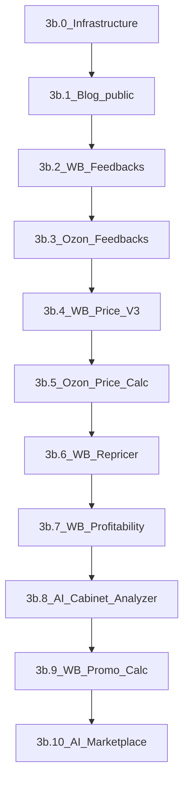

# Фаза 3b: Nuxt → Inertia — инструменты подписчика

Детальный план миграции 9 инструментов подписчика (+ публичный блог) на Inertia.

**Контекст:** общий план миграции — [plan.md](plan.md). Фазы 0a–3a завершены.

**Срок:** 5–7 недель (~47–60 рабочих дней с буфером).

---

## Фаза 3b: Nuxt → Inertia — инструменты подписчика (5–7 недель)

**Статус:** ✅ Фаза 3b завершена — все 9 инструментов и публичный блог на Inertia; в `subscriberNav.js` все маршруты инструментов в `availableRoutes` (без `comingSoon`).

**Источники для переноса:**

| Источник | Путь | Назначение |
| -------- | ---- | ---------- |
| Nuxt-страницы | `nuxt_front/pages/panel/` | UX-потоки, структура экранов |
| Nuxt-компоненты | `nuxt_front/components/subscriber/` | бизнес-логика UI (~65 WB, ~11 Oz) |
| Legacy API | `routes/api.php` + `Api/Subscriber/*` | контракты, валидация, сервисы |
| Документация | `docs/*.md` | регрессия, edge cases |

**Целевая структура (паттерн из 3a):**

```
routes/subscriber.php          — платформа (готово)
routes/subscriber-tools.php    — инструменты (новый файл, подключается из web.php)
app/Http/Controllers/Web/Subscriber/{Wb,Oz,Ai,Blog}/
app/Http/Requests/Web/Subscriber/
app/Services/Subscriber/         — тонкие обёртки; основная логика остаётся в app/Services/
resources/js/Pages/Subscriber/{Wb,Oz,Ai,Blog}/
resources/js/components/subscriber/tools/  — переиспользуемые блоки инструментов
```

Legacy API **не удалять** до Фазы 4 — Nuxt и Inertia работают параллельно на staging.

---

### 3b.0 Общая инфраструктура инструментов (2–3 дня)

Сделать **до** первого инструмента — иначе каждый модуль будет дублировать код.

#### Backend

- [x] Файл `routes/subscriber-tools.php` с группой `middleware(['auth', 'verified', 'role:Подписчик'])` + `prefix('panel')`
- [x] Базовый trait или abstract controller для инструментов: проверка permission, единый формат flash-ошибок
- [x] Form Requests в `app/Http/Requests/Web/Subscriber/` (по одному на write-операцию)
- [ ] Вынести повторяющуюся логику из `Api/Subscriber/*` в `app/Services/` там, где контроллеры дублируют код (не переписывать сервисы целиком) — по мере переноса модулей

#### Frontend — shared-компоненты

| Компонент | Назначение |
| --------- | ---------- |
| `CabinetList` / `CabinetForm` | CRUD кабинетов (WB/Ozon) — общий каркас |
| `ApiKeyField` | masked input + валидация WB/Ozon ключей |
| `ToolPageHeader` | заголовок, breadcrumbs, действия |
| `StatusBadge` + `JobProgress` | статусы фоновых задач |
| `FileUploadZone` | xlsx upload (promo, price calc, profitability) |
| `useToolPoll` composable | обёртка над Inertia `usePoll` для status-эндпоинтов |
| `EditableDataTable` | TanStack Table: inline-edit, column pin, virtual scroll |

#### Навигация

- [x] Расширять `availableRoutes` в `subscriberNav.js` после каждого модуля (WB Feedbacks: `/panel/wb/feedbacks`)
- [x] Breadcrumbs в `SubscriberLayout` — единый формат: `Wildberries → Отзывы → Кабинет`

#### Матрица миграции

- [x] Обновлять `docs/inertia-migration-matrix.md` после каждого PR

---

### Порядок модулей и оценки



| # | Модуль | Сложность | Срок | Nuxt pages | Ключевой риск |
| - | ------ | --------- | ---- | ---------- | ------------- |
| 0 | Инфраструктура | — | 2–3 дн | — | без неё — дублирование |
| 1 | Блог (публичный) | низкая | 2–3 дн | 2 | SEO, кеш |
| 2 | WB Отзывы | средняя | 4–5 дн | 4 | AI-автоответ, шаблоны |
| 3 | Ozon Отзывы | средняя | 3–4 дн | 2 | проще WB, без шаблонов |
| 4 | WB Ценообразование V3 | высокая | 5–7 дн | 2 | огромная редактируемая таблица |
| 5 | Ozon Ценообразование | высокая | 6–8 дн | 2 | FBO/FBS + polling статусов |
| 6 | WB Репрайсер | очень высокая | 7–10 дн | 8 | 3 стратегии, mass-edit |
| 7 | WB Рентабельность | высокая | 5–6 дн | 2 + partials | long-poll отчёта, графики |
| 8 | AI Cabinet Analyzer | высокая | 6–7 дн | 2 | long-poll отчёта + AI PDF |
| 9 | WB Калькулятор акций | низкая | 2–3 дн | 1 | зависит от Price V3 + Repricer |
| 10 | ИИ Инструменты | высокая | 5–7 дн | 1 | text/image/video, polling, медиа |

**Буфер на регрессию:** 3–5 дней. **Итого:** ~47–60 рабочих дней.

---

### 3b.1 Блог — публичный пилот (2–3 дня)

**Цель:** первый не-платформенный модуль; проверить паттерн «публичная страница без auth» + SEO.

| Legacy | Web | Inertia Page |
| ------ | --- | ------------ |
| `GET /api/subscriber/blog/posts` | `GET /blog` | `Blog/Index` |
| `GET /api/subscriber/blog/posts/{slug}` | `GET /blog/{slug}` | `Blog/Show` |
| `POST .../view` | `POST /blog/{slug}/view` | — (Inertia action) |
| `GET .../sitemap` | `GET /blog/sitemap.xml` | XML response |

**Контроллеры:** `Web/Blog/BlogPostController`, `Web/Blog/SitemapController` — reuse `BlogCacheService`, `BlogSlugService`.

**Не в scope 3b:** админка блога (уже на `/cw-page/blog/`).

**Чеклист:**

- [x] Список с фильтрами: category, tag, search
- [x] Страница поста: SEO meta, `published_at`, инкремент просмотров
- [x] Sitemap для поисковиков
- [x] Публичный layout (без `SubscriberLayout`, без sidebar)

---

### 3b.2 WB Отзывы (4–5 дней)

**Permission:** `subscriber wb feedbacks` · **Док:** [wb-feedbacks.md](docs/wb-feedbacks.md)

#### Nuxt → Inertia маппинг

| Nuxt page | Web route | Inertia Page |
| --------- | --------- | ------------ |
| `panel/wb/feedbacks/index` | `GET /panel/wb/feedbacks` | `Subscriber/Wb/Feedbacks/Index` |
| `panel/wb/feedbacks/client-[id]` | `GET /panel/wb/feedbacks/clients/{client}` | `.../Client/Show` |
| `panel/wb/feedbacks/templates-[id]` | `GET /panel/wb/feedbacks/clients/{client}/templates` | `.../Templates/Index` |
| `panel/wb/feedbacks/product/[cabinet]/[product]` | `GET /panel/wb/feedbacks/clients/{client}/products/{product}` | `.../Product/Stats` |

#### Web-контроллеры (reuse API-логики)

- `Web/Subscriber/Wb/Feedbacks/FeedbacksController` — list, send
- `Web/Subscriber/Wb/Feedbacks/ClientsController` — CRUD + bot-status + AI settings
- `Web/Subscriber/Wb/Feedbacks/TemplatesController` — CRUD шаблонов
- `Web/Subscriber/Wb/Feedbacks/StatsController` — виджеты, product stats

#### UI-блоки (из Nuxt components)

- Список кабинетов + лимит `feedbacks_clients`
- Лента неотвеченных отзывов (infinite scroll / «Загрузить ещё»)
- Форма ответа + отправка в WB
- Настройки бота (шаблоны по рейтингу)
- AI-автоответчик (рейтинги → `AiTaskType::WB_FEEDBACK_ANSWER_AI`)
- Виджеты статистики на главной странице инструмента

#### Особенности

- POST `/list` с `skip` — partial reload или отдельный JSON fragment через `only`
- Проверка лимита подписки при создании кабинета

---

### 3b.3 Ozon Отзывы (3–4 дня)

**Permission:** `subscriber oz feedbacks` · **Док:** [ozon-feedbacks.md](docs/ozon-feedbacks.md)

| Nuxt page | Web route | Inertia Page |
| --------- | --------- | ------------ |
| `panel/oz/feedbacks/index` | `GET /panel/oz/feedbacks` | `Subscriber/Oz/Feedbacks/Index` |
| `panel/oz/feedbacks/cabinet-[id]` | `GET /panel/oz/feedbacks/cabinets/{cabinet}` | `.../Cabinet/Show` |

**Отличия от WB:** нет шаблонов; есть `countFeedbacks`; AI/bot-status на уровне кабинета.

**Контроллеры:** `Web/Subscriber/Oz/Feedbacks/{Feedbacks,Clients}Controller`.

---

### 3b.4 WB Ценообразование V3 (5–7 дней)

**Permission:** `subscriber wb price calculator` · **Док:** [wb-price-calculation-v3.md](docs/wb-price-calculation-v3.md)

| Nuxt page | Web route | Inertia Page |
| --------- | --------- | ------------ |
| `panel/wb/price-calc/index` | `GET /panel/wb/price-calc` | `Subscriber/Wb/PriceCalc/Index` |
| `panel/wb/price-calc/cabinet-[id]` | `GET /panel/wb/price-calc/cabinets/{cabinet}` | `.../Cabinet/Show` |

#### Функциональность

- CRUD кабинетов (`PriceCalcCabinetsController`)
- Таблица карточек: **40+ колонок**, inline-edit, сортировка, фильтры
- Settings dialog: параметры расчёта на кабинет
- Sync карточек из WB API
- Import/Export Excel (`import-excel`, `export-excel`, `import-volume`)
- Кнопка «Рассчитать» → `calculate`

#### UI-риски

- Самая плотная таблица в проекте — обязательны: column pin, resize, virtual scroll
- Референс колонок: поля из `wb_price_calc_v3_data` в доке

---

### 3b.5 Ozon Ценообразование (6–8 дней)

**Permission:** `subscriber oz price calc` · **Док:** [ozon-price-calculation.md](docs/ozon-price-calculation.md), [ozon-price-calculation-frontend-columns.md](docs/ozon-price-calculation-frontend-columns.md)

| Nuxt page | Web route | Inertia Page |
| --------- | --------- | ------------ |
| `panel/oz/price-calc/index` | `GET /panel/oz/price-calc` | `Subscriber/Oz/PriceCalc/Index` |
| `panel/oz/price-calc/cabinet-[id]` | `GET /panel/oz/price-calc/cabinets/{cabinet}` | `.../Cabinet/Show` |

#### Функциональность

- CRUD кабинетов Ozon
- Вкладки **FBO** / **FBS** — отдельные таблицы, разные расчётные поля
- Операции с polling (`useToolPoll`):
  - `sync` → `status`
  - `calculate` → `calculate-status`
  - `import` → `import-status`
  - `export` → `export-status`

#### UI-риски

- Два режима таблицы с разными колонками — вынести column defs в `config/ozPriceCalcColumns.js`
- Длительные фоновые задачи — progress UI обязателен

---

### 3b.6 WB Репрайсер (7–10 дней)

**Permission:** `subscriber wb repricer` · **Док:** [wb-repricer.md](docs/wb-repricer.md)

Самый объёмный модуль по числу экранов.

#### Маршруты

| Nuxt page | Web route |
| --------- | --------- |
| `repricer/index` | `GET /panel/wb/repricer` |
| `repricer/[cabinet_id]/index` | `GET /panel/wb/repricer/cabinets/{cabinet}` |
| `.../stocks/index` | `GET .../stocks` |
| `.../stocks/mass` | `GET .../stocks/mass` |
| `.../time/index` | `GET .../time` |
| `.../time/mass` | `GET .../time/mass` |
| `.../competitors/index` | `GET .../competitors` |

#### Три стратегии

1. **По остаткам (stocks)** — CRUD + mass load/update/delete + sizes из WB + reset
2. **По времени (settings)** — CRUD + mass load/update/delete
3. **По конкурентам (competitors)** — search + `usePoll` на `search/status`, board UI, toggle status

#### Контроллеры

- `RepricerCabinetsController` (+ logs)
- `RepricerStocksController`
- `RepricerSettingsController`
- `RepricerCompetitorsController`

#### Зависимости

- Интеграция с Promo Calculator (`sendToRepricer`) — делать после 3b.9 или stub
- Webhook `POST /services/wb-search/webhook` — **не трогать** (остаётся в API)

---

### 3b.7 WB Рентабельность (5–6 дней)

**Permission:** `subscriber wb profitability` · **Док:** [wb-profitability.md](docs/wb-profitability.md)

| Nuxt page | Web route | Inertia Page |
| --------- | --------- | ------------ |
| `profitability/index` | `GET /panel/wb/profitability` | `Subscriber/Wb/Profitability/Index` |
| `profitability/[cabinet_id]` | `GET /panel/wb/profitability/cabinets/{cabinet}` | `.../Cabinet/Show` |

#### Функциональность

- CRUD кабинетов
- Запуск отчёта → `ProcessProfitabilityReport` job
- **`usePoll` на `status/{cabinet}`** (без throttle) пока отчёт генерируется
- Таблица операций + виджеты (ApexCharts): sales, logistics, returns, totals
- Export XLSX
- Partials из Nuxt (`_partials/`) → Vue-компоненты в `components/subscriber/wb/profitability/`

---

### 3b.8 AI Cabinet Analyzer (6–7 дней) ✅

**Permission:** `subscriber wb ai cabinet analyzer` · **Док:** [wb-ai-cabinet-analyzer.md](docs/wb-ai-cabinet-analyzer.md)

| Nuxt page | Web route | Inertia Page |
| --------- | --------- | ------------ |
| `ai-cabinet-analyzer/index` | `GET /panel/wb/ai-cabinet-analyzer` | `Subscriber/Wb/AiCabinetAnalyzer/Index` |
| `ai-cabinet-analyzer/[cabinet_id]` | `GET /panel/wb/ai-cabinet-analyzer/cabinets/{cabinet}` | `.../Cabinet/Show` |

#### Web-контроллеры

- `Web/Subscriber/Wb/AiCabinetAnalyzer/CabinetsController` — CRUD
- `Web/Subscriber/Wb/AiCabinetAnalyzer/WorkspaceController` — show + start report
- `Web/Subscriber/Wb/AiCabinetAnalyzer/AiAnalysesController` — start/regenerate/show JSON/download PDF

#### Функциональность

- CRUD кабинетов
- Запуск snapshot-отчёта → `useAiCabinetReportPoll` (5 с, timeout 15 мин)
- Таблица номенклатур с воронкой + рекламой (TanStack Table, поиск nomenclatures)
- AI-анализ: templates, start/regenerate, history table, lazy JSON detail dialog, PDF download
- Референс полей воронки: [wb-ai-cabinet-analyzer-sales-funnel-fields.md](docs/wb-ai-cabinet-analyzer-sales-funnel-fields.md)

**Чеклист:**

- [x] Backend: controllers, Form Requests, `EnsuresAiCabinetAnalyzerOwnership`
- [x] Routes в `subscriber-tools.php`
- [x] Inertia Pages: `Index`, `Cabinet/Show`
- [x] Компоненты: `ReportRunPanel`, `NomenclaturesTable`, `AiAnalysisSection`, `AiAnalysisLauncher`, `AiAnalysesHistoryTable`, `AiAnalysisDetailDialog`
- [x] Polling: `useAiCabinetReportPoll`, `useAiCabinetAnalysesPoll`
- [x] `availableRoutes` в `subscriberNav.js`
- [x] Feature-тесты: `WbAiCabinetAnalyzerTest` (11 тестов)
- [x] Матрица: `inertia-migration-matrix.md`

---

### 3b.9 WB Калькулятор акций (2–3 дня) ✅

**Permission:** `subscriber wb promo calculator` · **Док:** [wb-promo-calculator.md](docs/wb-promo-calculator.md)

| Nuxt page | Web route | Inertia Page |
| --------- | --------- | ------------ |
| `promocalculator/index` | `GET /panel/wb/promocalculator` | `Subscriber/Wb/PromoCalculator/Index` |

#### Web-контроллер

- `Web/Subscriber/Wb/PromoCalculator/PromoCalculatorController` — index + JSON: upload, calculate, export, repricer

#### Функциональность (одна страница, wizard-flow)

1. Upload xlsx → путь файла (`POST /panel/wb/promocalculator/upload`)
2. Выбор кабинета Price Calc (SSR props)
3. Calculate → таблица маржи (`POST /panel/wb/promocalculator/calculate`)
4. Export xlsx (`POST /panel/wb/promocalculator/export`)
5. «Отправить в репрайсер» (`POST /panel/wb/promocalculator/repricer`, payload `{ nm_id, plan_price }`)

**Чеклист:**

- [x] Backend: Web controller, Form Requests, ownership checks
- [x] Routes в `subscriber-tools.php`
- [x] Inertia Page + composable `usePromoCalculatorApi`
- [x] Компоненты wizard/results/repricer
- [x] API fix: `sendToRepricer` named fields
- [x] `availableRoutes` в `subscriberNav.js`
- [x] Feature-тесты: `WbPromoCalculatorTest`
- [x] Матрица: `inertia-migration-matrix.md`

---

### 3b.10 ИИ Инструменты (5–7 дней) ✅

**Permission:** `subscriber ai` · **Док:** [ai-marketplace.md](docs/ai-marketplace.md)

| Nuxt page | Web route | Inertia Page |
| --------- | --------- | ------------ |
| `panel/ai/index` | `GET /panel/ai` | `Subscriber/Ai/Index` |

#### Web-контроллеры

- `Web/Subscriber/Ai/MarketplaceController` — index + marketplace/video/limits JSON
- `Web/Subscriber/Ai/MediaController` — private AI media

#### Функциональность

- Вкладки Текст / Изображения / Видео (`GeminiController@marketplace`, `GrokVideoController`)
- Генерация изображений + preview через `/panel/ai/media/{path}`
- Video: `start` / `reference/start` + polling `video/status/{id}` (`useAiVideoPoll`)
- Отображение лимитов AI из подписки (SSR + refresh)
- Composable `useAiGeneration` для общего fetch-слоя

**Чеклист:**

- [x] Backend: controllers, Form Requests, делегирование в API
- [x] Routes в `subscriber-tools.php`
- [x] Inertia Page + composables (`useMarketplaceAi`, `useAiMediaUrl`, `useAiVideoPoll`)
- [x] Компоненты: формы text/image/video, результаты, history sidebar
- [x] `availableRoutes` в `subscriberNav.js`, label **«ИИ Инструменты»**
- [x] Feature-тесты: `AiMarketplaceTest`
- [x] Матрица: `inertia-migration-matrix.md`

---

### Вне scope 3b (отдельно или Фаза 4+)

Эти Nuxt-страницы есть в репо, но **не входят в 9 инструментов**:

| Страница | Permission | Примечание |
| -------- | ---------- | ---------- |
| `/panel/manager` | `subscriber` | лендинг «личный менеджер» |
| `/panel/manager/fullfilment` | `manager fullfilment` | см. [fullfilment.md](docs/fullfilment.md) |
| `/panel/fullfilment-calc` | `subscriber` | калькулятор |
| `/fullfilment`, `/public-offer`, `/` | публичные | маркетинговые |

---

### Паттерн работы на каждый модуль (PR-чеклист)

1. **Инвентаризация** — список Nuxt pages + API endpoints + docs
2. **Backend** — `Web/*Controller`, Form Requests, вызов существующих Services
3. **Routes** — `routes/subscriber-tools.php` + permission middleware
4. **Frontend** — Inertia Pages + shared components; **не** копировать PrimeVue/Vuetify из Nuxt
5. **Polling** — `useToolPoll` для всех `*/status` эндпоинтов
6. **Навигация** — добавить href в `availableRoutes`
7. **Тесты** — Feature test: auth, permission, happy path CRUD
8. **Матрица** — строка в `inertia-migration-matrix.md`
9. **Регрессия** — сверка с `docs/{module}.md`

---

### Критерии готовности Фазы 3b

- [x] Все 9 инструментов доступны из sidebar без `comingSoon` (`availableRoutes` в `subscriberNav.js`)
- [x] Публичный блог на `/blog` (Inertia) — 3b.1, `PublicBlogTest`
- [x] Подписчик может работать **только** через Inertia (Nuxt не обязателен на staging) — все 9 модулей + платформа 3a на web-маршрутах
- [x] Legacy API в `routes/api.php` ещё жив — для отката и параллельного Nuxt
- [x] `npm run build` без ошибок; feature-тесты на каждый модуль (3b.0–3b.10)
- [x] Очереди (`queue:work`) обрабатывают jobs инструментов при Inertia-flow — Web-контроллеры делегируют в те же API/Services и jobs, что и Nuxt

---

## Чеклист задач (Фаза 3b)

- [x] **3b.0:** Общая инфраструктура инструментов
- [x] **3b.1:** Блог (публичный)
- [x] **3b.2:** WB Отзывы
- [x] **3b.3:** Ozon Отзывы
- [x] **3b.4:** WB Ценообразование V3
- [x] **3b.5:** Ozon Ценообразование
- [x] **3b.6:** WB Репрайсер (v1: time + stocks list CRUD; без competitors/mass)
- [x] **3b.7:** WB Рентабельность
- [x] **3b.8:** AI Cabinet Analyzer
- [x] **3b.9:** WB Калькулятор акций
- [x] **3b.10:** ИИ Инструменты